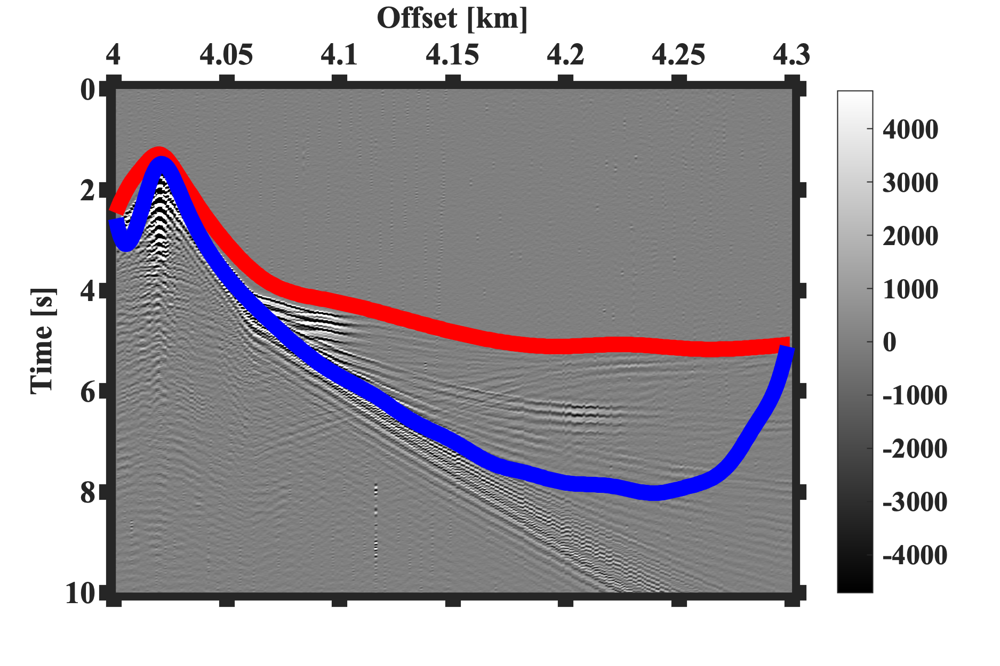
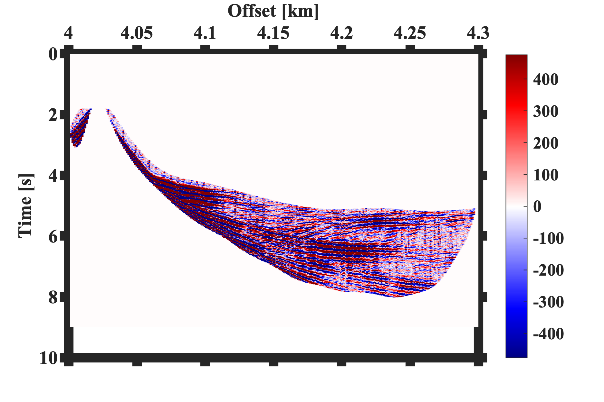

## Muting seimsic files before modeling`
We may need to muffle some parts of the data set before modeling seismic data. This work is vital in full wave inversion (FWI).

I have created a free graphical code to do this task, called `MUTE_SEGY_CODE`. Muting the data is applied to one Segy file in the folder called `synthetic_data1.segy`.

After defining the initial parts of the code (explained in the code), the first step is to define the upper and lower layers of the favorite area of data. As you see in the figure, the layers should be selected from left to right, and the layer is chosen by double clicking the mouse on the right part of the figure.

The code starts interpolating the selected region as follows:

and at the end, the selected region is as follows:

The muted Segy file can be found in the folder MUTED_SEGY_FILES.

`DISCLAIMER`:  I don't warrant this code in any way whatsoever. This code is provided "as-is" to be used at your own risk.

